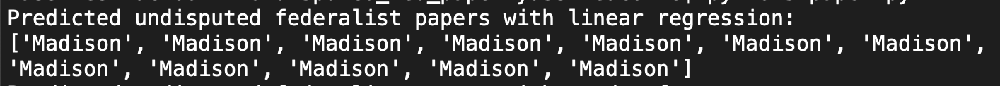
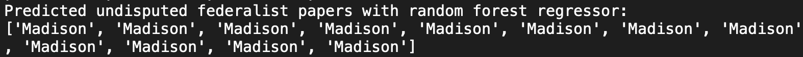

# The Disputed Federalist Papers

## Due Sunday, April 28

## Description

*The Federalist Papers* are a collection of essays written by Alexander Hamilton, James Madison, and John Jay, first published as newspaper articles in 1787 and 1788 and then later collected into book form. Originally written to encourage the people of New York to ratify the new U.S. Constitution, the *Papers* are considered to be classics of political science, providing essential insight into the Founding Fathers' views on government.
Source: /dansmyers

Twelve of the Federalist papers never had any author attributed to, hence them being called disputed federalist papers. This project utilizes two different machine learning techiques to predict the authorship of the disputed papers; Linear Regression and Random Forest Regression.

## Text Analysis

In 1998, Robert Bosch and James Smith used **word counts** to distinguish between Madison and Hamilton's papers . They identified a set of 70 basic **function words** that are useful for textual analysis and counted their occurrences in each of *The Federalist Papers*. They then used these 70-element vectors to build a model that could classify Hamilton and Madison's known papers correctly. 

source: /dansmyers

### Data Set

The file `federalist_paper_data.csv` contains the word frequency used for each word associated to those in the .txt file.

The file has 118 lines, corresponding to 118 text excerpts. The first entry on each line is the class of the text excerpt:

- 1 for Hamilton's papers
- 2 for Madison's papers
- 3 for disputed papers

The remaining 70 values are the frequency of occurrence of the 70 function words in the text, scaled to units of estimated occurrences per 1000 words. The list of functions words is in `federalist_papers_wordlist.txt`.

### Conclusion

After using linear regression (LR) and random forest regression (RFR), it seems that RFR is more accurate with mean absolute error of 0.515 and 0.088, respectively. These error values were found by splitting the known authored undisputed papers by training and testing data.

The linear regression after being trained, gave a result of 9 papers written by Madison and 3 by Hamilton.

The RFR after being trained with the entire data set, resulted in predicting all the disputed papers as written by Madison.

## Papers that use different forms of machine learning to solve the disputed federalist paper problem.

Bosch, Smith, and Fung attributed all of the 12 disputed papers to Madison. This agrees with the opinions of other scholars, although there are arguments that some of the essays attributed to Madison may have been collaborative efforts.

Fung, G. (2003, October). The disputed Federalist Papers: SVM feature selection via concave minimization. In Proceedings of the 2003 Conference on Diversity in Computing (pp. 42-46). ACM.

Bosch, R. A., & Smith, J. A. (1998). Separating hyperplanes and the authorship of the disputed federalist papers. The American mathematical monthly, 105(7), 601-608.
